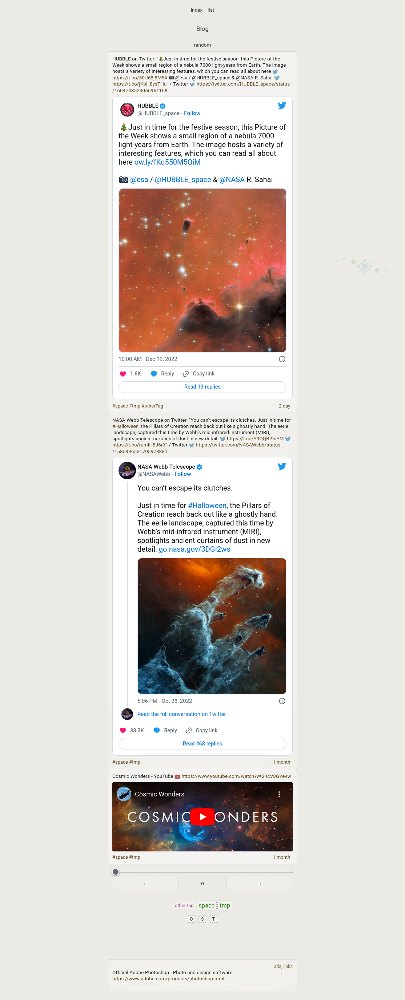

README.md

<!-- comment -->

# Blog from JSON data and JavaScript

#### JSON data in JavaScript var example (URL in JSON is optional, it is combined with text in the script)
```javascript
var blogJsonVar = 
[
    {
        "id": 251,
        "text": "test2 text2",
        "url": "https:\/\/test2.com",
        "tag": "#test2 #tag",
        "time": 1671480576
    },
    {
        "id": 250,
        "text": "test text",
        "url": "https:\/\/test.com",
        "tag": "#test #tag",
        "time": 1668444918
    }
]

```



<!--
## title
###### title


- list
 - list
  - list

[example.com](http://example.com/)

#### screenshot

-->

